# Diagrama De Caso De Uso

Data de referencia: 2026-04-04

Este diagrama resume os principais atores e casos de uso do projeto `Library` no formato textual com Mermaid, facilitando leitura e manutencao do documento.

```mermaid
flowchart TD
    U[Usuario] --> UC1[Cadastrar conta]
    U --> UC2[Autenticar]
    U --> UC3[Consultar catalogo]
    U --> UC4[Filtrar livros]
    U --> UC5[Visualizar detalhes do livro]
    U --> UC6[Iniciar leitura]
    U --> UC7[Atualizar progresso]
    U --> UC8[Gerenciar favoritos]
    U --> UC9[Definir metas]
    U --> UC10[Consultar alertas e streak]
    U --> UC11[Criar e editar review]
    U --> UC12[Consultar badges]
    U --> UC13[Consultar leaderboard]
    A[Administrador] --> AC1[Gerenciar categorias]
    A --> AC2[Gerenciar tags]
    A --> AC3[Gerenciar colecoes]
    A --> AC4[Gerenciar livros]
    A --> AC5[Importar Open Library]
    A --> AC6[Gerenciar badges]
    A --> AC7[Consultar usuarios]
    A --> AC8[Consultar metricas]
    A --> AC9[Consultar auditoria de alertas]
```

