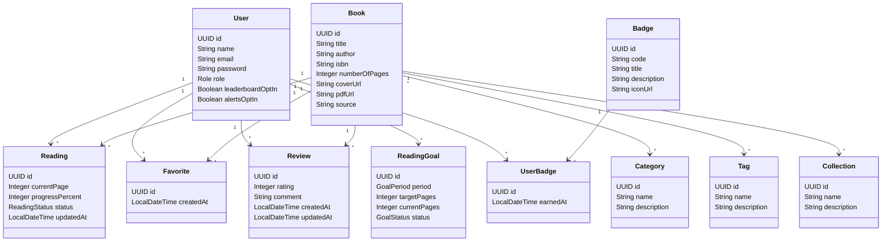

# Diagrama De Classe

Data de referencia: 2026-04-04

Este diagrama representa os principais agregados e relacionamentos do projeto `Library`, mantendo foco no entendimento arquitetural e na manutencao.

